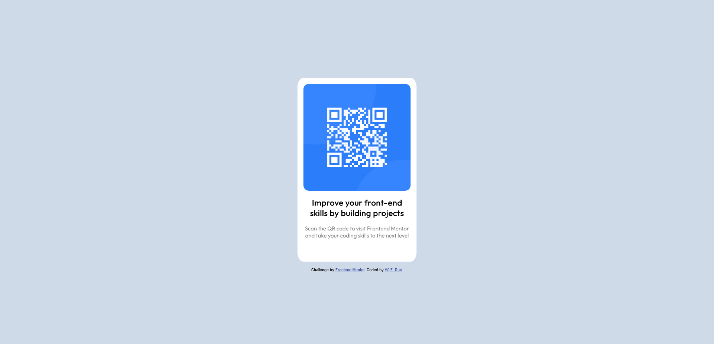

# Frontend Mentor - QR code component solution

This is a solution to the [QR code component challenge on Frontend Mentor](https://www.frontendmentor.io/challenges/qr-code-component-iux_sIO_H). Frontend Mentor challenges help you improve your coding skills by building realistic projects. 

## Table of contents

- [Overview](#overview)
  - [Screenshot](#screenshot)
- [My process](#my-process)
  - [Built with](#built-with)
  - [What I learned](#what-i-learned)
  - [Continued development](#continued-development)
- [Author](#author)

**Note: Delete this note and update the table of contents based on what sections you keep.**

## Overview

### Screenshot

**Note: Delete this note and the paragraphs above when you add your screenshot. If you prefer not to add a screenshot, feel free to remove this entire section.**

## My process

### Built with

- Semantic HTML5 markup
- CSS custom properties
- Flexbox
- CSS Grid

**Note: These are just examples. Delete this note and replace the list above with your own choices**

### What I learned

I got myself acquainted with using Figma and Sketch files. It took a lot of experimenting to get the CSS as close to the original as possible. I learned a lot about how to utilize the CSS I had learned about in previous web development courses.

**Note: Delete this note and the content within this section and replace with your own learnings.**

### Continued development

I definitely have a lot to learn if I want to intuitively space out elements. Less code definitely accomplishes more. I would like to learn more about patterns in spacing out elements in a webpage and how to access more of the specific dimensions in a .sketch file.

**Note: Delete this note and replace the list above with resources that helped you during the challenge. These could come in handy for anyone viewing your solution or for yourself when you look back on this project in the future.**

## Author

- Frontend Mentor - [@werue](https://www.frontendmentor.io/profile/werue)

**Note: Delete this note and add/remove/edit lines above based on what links you'd like to share.**

**Note: Delete this note and edit this section's content as necessary. If you completed this challenge by yourself, feel free to delete this section entirely.**
